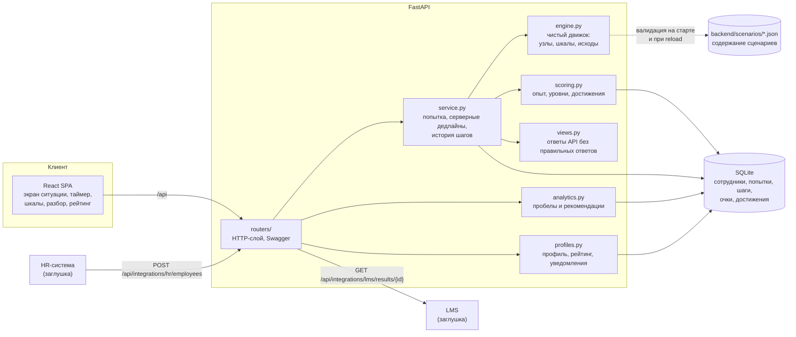
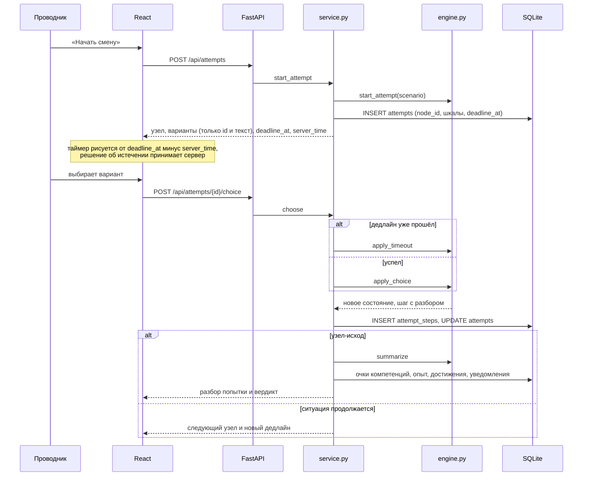
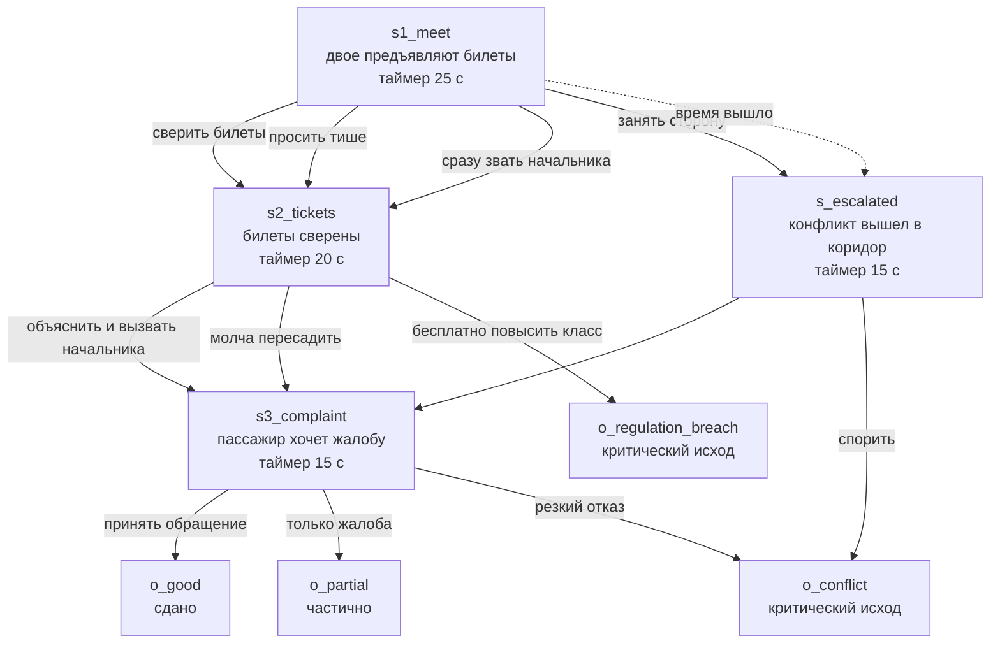
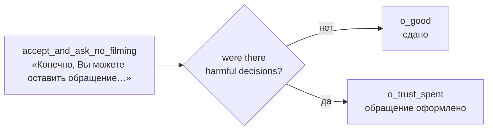
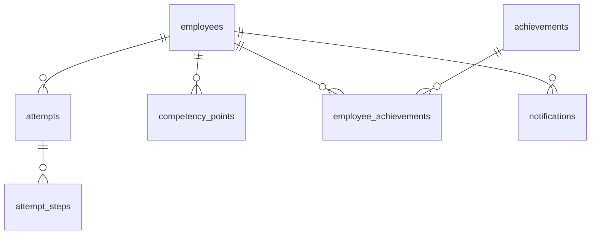

# Архитектура

## Компоненты

Главное решение архитектуры: **движок не знает ни про HTTP, ни про базу**.
`engine.py` принимает сценарий и состояние, возвращает новое состояние и разбор.
Время и хранение живут уровнем выше, в `service.py`. Отсюда три следствия:

- правила проверяются юнит-тестами без сервера и базы;
- движок можно объяснить по одному файлу на защите;
- содержание (JSON-сценарии) меняется без правки кода.

## Прохождение шага

## Модель сценария

Сценарий — граф узлов. Узел ситуации содержит текст, реплику пассажира, таймер и
варианты; узел-исход содержит вердикт.

Каждый вариант несёт:

- `quality` — `optimal`, `acceptable` или `harmful`;
- `effects` — сдвиг лояльности, безопасности и очков компетенций;
- `debrief` — что именно сработало или не сработало;
- `next` — следующий узел;
- `branches` — условные переходы, которые срабатывают вместо `next`.

### Условные переходы

Маршрут зависит не только от нажатой кнопки. У варианта и у исхода по таймауту
может быть список условных ветвей; они проверяются по порядку, побеждает первая
подходящая, иначе берётся обычный `next`.

В условии доступны пороги по обеим шкалам (`loyalty_below`, `loyalty_at_least`,
`safety_below`, `safety_at_least`) и факты о ходе попытки (`after_timeout`,
`after_harmful`). Шкалы сравниваются уже после применения эффектов решения, а
таймауты и ошибки считаются вместе с текущим шагом, поэтому условие читается так
же, как его воспринимает человек: «если после этого решения безопасность ниже
порога». Сработавшая ветка пишет `note` в шаг попытки, и проводник видит на
экране, почему ситуация свернула с обычного пути.

Условия задают разную цену: обращение пассажира на действия проводника закрывает
попытку как несданную, а потерянное доверие в медицинской ситуации меняет финал и
разбор, но протокол остаётся выполненным.

Узел-исход может быть помечен `critical_failure: true`. Такой исход никогда не
считается сданным, даже если шкалы формально выше порогов: нарушение регламента
нельзя «выкупить» хорошими шкалами.

### Что проверяется при загрузке сценария

`engine.validate` не пропустит сценарий, если:

- стартовый узел или ссылка `next` указывают на несуществующий узел;
- условный переход ведёт в несуществующий узел, не имеет условия вообще или
  содержит условие, которое никогда не выполнится (например, безопасность
  одновременно ниже 50 и не ниже 60);
- у узла ситуации нет вариантов или есть таймер без исхода по таймауту;
- у узла-исхода нет вердикта или есть варианты;
- в узле нет ни одного различия по качеству вариантов (иначе выбор ничего не значит);
- есть недостижимые узлы — «мёртвая» ветка, которую никто не увидит;
- `critical_failure` стоит не на узле-исходе.

Проверка выполняется на старте сервиса и при `POST /api/scenarios/reload`.

## Данные

- `attempts` хранит текущий узел, обе шкалы и `deadline_at` — дедлайн шага живёт
  на сервере, поэтому перезагрузка страницы не продлевает время на решение;
- `attempt_steps` хранит шаг в том виде, в котором его вернул движок, поэтому
  разбор собирается из истории, а не пересчитывается заново;
- `employees` содержит только служебные поля (логин, отображаемое имя,
  должность, бригада, депо) и не содержит персональных данных.

## Безопасность в прототипе

- `views.OptionView` отдаёт только `id` и текст варианта. Качество вариантов и
  их влияние на шкалы остаются на сервере: правильный ответ нельзя посмотреть в
  инструментах разработчика.
- Таймер считает сервер. Клиент лишь сообщает об истечении, но решение о
  таймауте принимается по `deadline_at` в базе; запоздавший выбор автоматически
  превращается в таймаут (с запасом `TIMER_GRACE_SECONDS` на сетевую задержку).
- Домены для CORS задаются переменной `VSM_ALLOWED_ORIGINS`.
- Аутентификации в прототипе нет — это осознанное ограничение демо-контура,
  см. [LIMITS_AND_ROADMAP.md](LIMITS_AND_ROADMAP.md).

## Переменные окружения

| Переменная | По умолчанию | Назначение |
|---|---|---|
| `VSM_DB_PATH` | `backend/data/vsm.sqlite3` | путь к файлу базы (в Docker — том `/data`) |
| `VSM_ALLOWED_ORIGINS` | `http://localhost:5173,http://127.0.0.1:5173` | разрешённые источники для CORS |
| `VSM_API_URL` | `http://127.0.0.1:8000` | адрес бэкенда для прокси dev-сервера |
| `VSM_HOST` | `127.0.0.1` | интерфейс, который слушает dev-сервер Vite |
